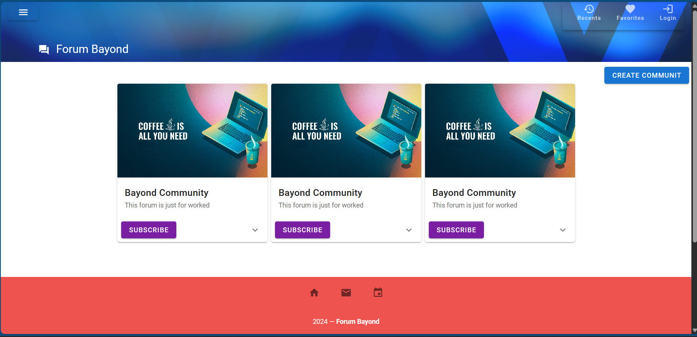
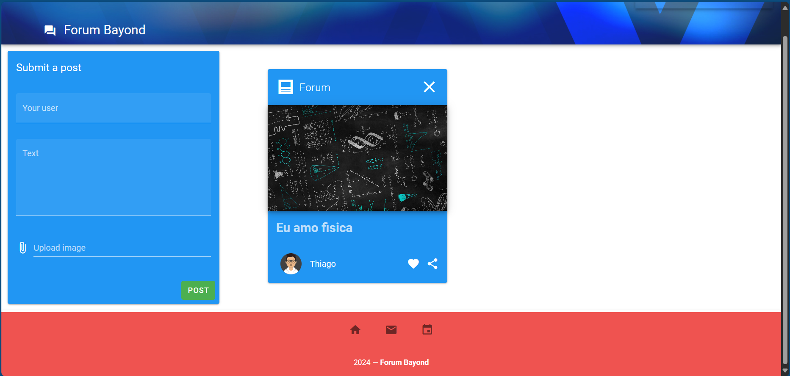
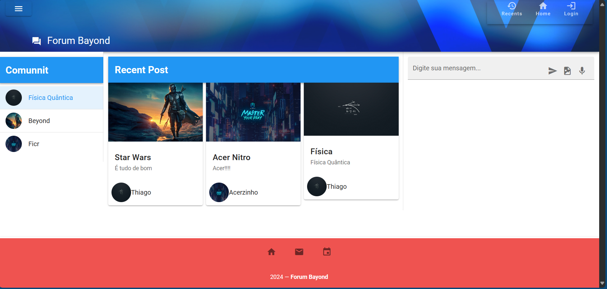
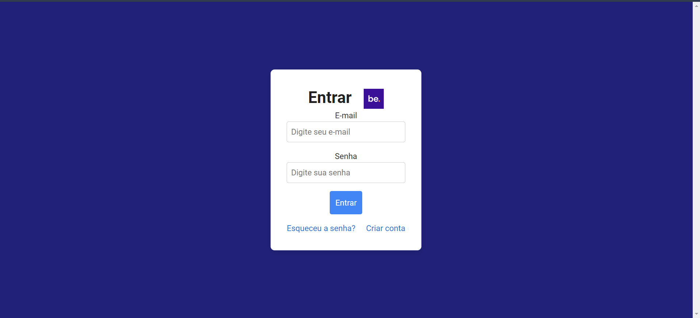
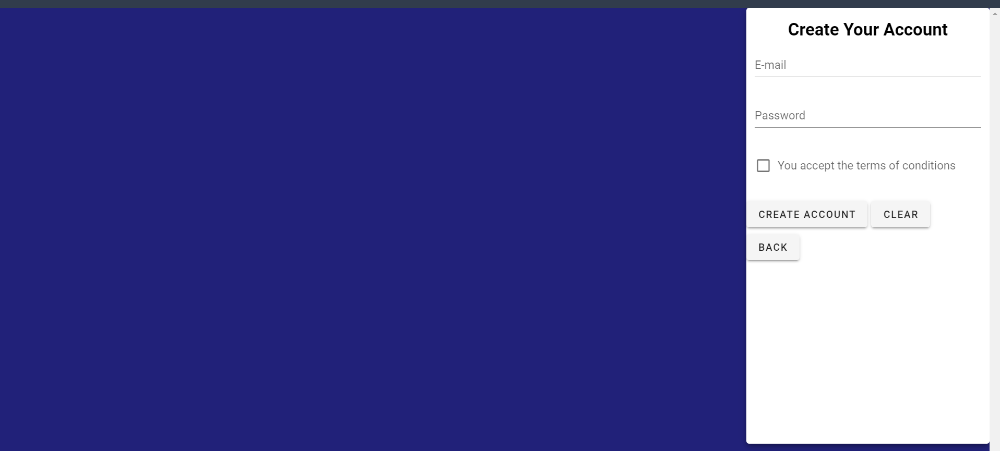

# Forum Bayond

**Forum Bayond** é uma plataforma de discussão online onde as pessoas podem criar comunidades para conversas, troca de ideias e aprendizado. Este projeto visa proporcionar um ambiente onde todos possam compartilhar conhecimentos, discutir tópicos interessantes e encontrar pessoas com interesses semelhantes.

## Recursos do Projeto

- **Comunidades de Discussão**: Participe de comunidades que abordam uma ampla variedade de tópicos. Seja para entretenimento, aprendizado ou negócios, há um espaço para todos.
- **Inscrição em Fóruns**: Explore a página inicial para descobrir fóruns interessantes e inscreva-se para se juntar às discussões.
- **Criação de Fóruns**: Use uma caixa de diálogo intuitiva para criar seu próprio fórum, adicionando tópicos de interesse e convidando outros usuários.
- **Chats em Tempo Real**: Os fóruns têm seções de chat para comunicação instantânea entre membros.
- **Design Responsivo**: O layout é responsivo para oferecer uma boa experiência tanto em dispositivos móveis quanto em computadores.
- **Tela de login e criar conta**: Temos a criação de duas delas uma para se efetuar o login e outra para criar uma conta para o usuario.

## Como Usar

1. **Navegação na Página Inicial**: Acesse a página inicial para ver a lista de fóruns. Clique para se inscrever nos que mais lhe interessam.
2. **Participação nos Fóruns**: Após a inscrição, você pode postar mensagens, responder a outros membros e interagir nas conversas.
3. **Uso do Chat**: Cada fórum possui uma seção de chat em tempo real para uma comunicação mais ágil.
4. **Criação de Fóruns**: Para criar um fórum, clique no botão de diálogo "Criar Fórum" e insira as informações necessárias, como título e descrição.

## Contribuindo para o Projeto

Se deseja contribuir para o projeto, siga estas etapas:

1. **Clone o Repositório**: Clone o repositório para seu ambiente local usando `git clone`.
2. **Crie uma Nova Branch**: Sempre faça alterações em uma nova branch.
3. **Implemente Suas Mudanças**: Faça alterações, correções ou adições necessárias.
4. **Faça um Pull Request**: Crie um pull request descrevendo suas alterações e aguarde revisão.

## Requisitos Técnicos

- **Framework Vue.js**: O projeto é construído com Vue.js, uma framework JavaScript progressiva para construção de interfaces de usuário.
- **Vuetify**: Utilizamos Vuetify para componentes de UI e estilos visuais.
- **VueRouter**: Utilizei VueRouter para linkar as paginas.
- **Vuex**: Utilizado para gerenciamento de estado.
- **Autenticação com Firebase**: A autenticação é tratada usando o Firebase Authentication.

## Contato e Suporte

Para suporte ou perguntas sobre o projeto, entre em contato pelo e-mail thiagoralmeida23@gmail.com ou abra uma issue no repositório do GitHub. A comunidade está sempre disposta a ajudar.

## Fotos do projeto

Aqui tenho algumas fotos para uma pequena visualização do projeto:

